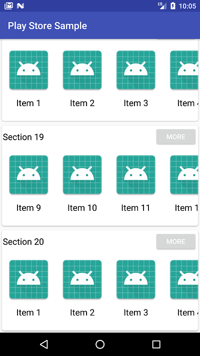

# PlayStoreSample
Create an application with both vertically scroll-able and horizontally scroll-able like Google Play Store application. 
This content would be useful for you if you want to structure your app like Google Play Store.

# Screenshot

# versi 2 
Add custom multiple viewHolder
reff : https://www.journaldev.com/12372/android-recyclerview-example
